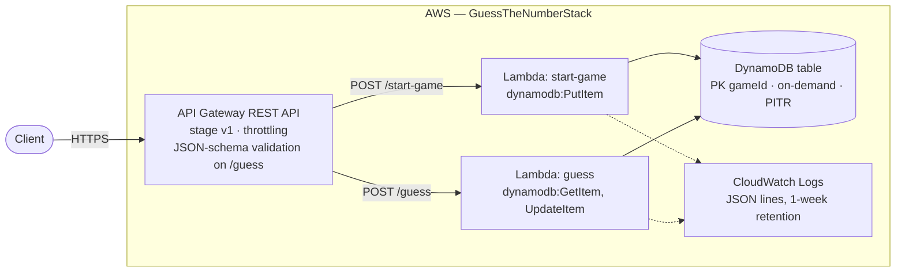

# Guess the Number — serverless REST API

A small "Guess the Number" game built on **Amazon API Gateway**, **AWS Lambda** and **Amazon DynamoDB**, with all infrastructure defined in **AWS CDK (TypeScript)**.

1. `POST /start-game` creates a game with a secret number between 1 and 100 and returns its `gameId`.
2. `POST /guess` compares a guess with the secret number and answers _too low_, _too high_ or _correct_.

## Architecture



A game is stored as one DynamoDB item:

| Attribute      | Type   | Description                     |
| -------------- | ------ | ------------------------------- |
| `gameId`       | String | Partition key, random UUID v4   |
| `secretNumber` | Number | 1–100, never returned or logged |
| `status`       | String | `IN_PROGRESS` → `WON`           |
| `createdAt`    | String | ISO 8601 timestamp              |

## API

Full contract: [`docs/openapi.yaml`](docs/openapi.yaml). Every response is JSON; errors use the same `{"message": "..."}` shape as successful guesses.

| Endpoint           | Success                                                                                                           | Errors                                                                           |
| ------------------ | ----------------------------------------------------------------------------------------------------------------- | -------------------------------------------------------------------------------- |
| `POST /start-game` | **201** `{"gameId": "<uuid>", "message": "Game started. Make a guess between 1 and 100."}`                        | 500                                                                              |
| `POST /guess`      | **200** `{"message": "Too low. Try again!"}` · `"Too high. Try again!"` · `"Correct! You've guessed the number."` | **400** invalid body · **404** unknown `gameId` · **409** game already won · 500 |

Both endpoints can also return **429** when the stage throttling limit is exceeded. Unknown routes and methods return **404** `{"message": "Not found."}`.

```bash
API_URL=https://<api-id>.execute-api.<region>.amazonaws.com/v1/  # the ApiUrl stack output

curl -s -X POST "${API_URL}start-game"
# {"gameId":"3f2b8c1e-...","message":"Game started. Make a guess between 1 and 100."}

curl -s -X POST "${API_URL}guess" -H 'Content-Type: application/json' \
  -d '{"gameId":"3f2b8c1e-...","guess":50}'
# {"message":"Too high. Try again!"}

curl -s -X POST "${API_URL}guess" -H 'Content-Type: application/json' \
  -d '{"gameId":"3f2b8c1e-...","guess":"fifty"}'
# HTTP 400 {"message":"Request body must be a JSON object with a UUID gameId and an integer guess between 1 and 100."}
```

## Project structure

```
bin/app.ts                         CDK app entry point
lib/guess-game-stack.ts            Table, Lambdas, IAM grants, REST API, validation, outputs
src/domain/game.ts                 Pure game rules: secret generation, guess evaluation, messages
src/http/validation.ts             /guess request body parsing and validation (zod)
src/http/responses.ts              JSON response helpers
src/repository/game-repository.ts  GameRepository interface + DynamoDB implementation
src/handlers/*.ts                  Handler factories (repository injected → unit-testable)
src/lambda/*.ts                    Lambda entry points wiring handlers to the real repository
src/logger.ts                      Structured JSON logger
test/unit                          Domain, validation and handler tests (in-memory repository)
test/infra                         CDK assertion tests on the synthesized template
test/integration                   Repository and handlers against DynamoDB Local
test/e2e                           Full game against a deployed API (needs API_URL)
docs/openapi.yaml                  OpenAPI 3.0 description of the API
scripts/local.sh                   Deploy to the Floci emulator and run the e2e suite locally
scripts/play.ts                    Interactive terminal client for playing against a deployed API
.github/workflows/ci.yml           Lint, typecheck, tests, integration tests, cdk synth
```

## Design decisions

- **One Lambda per endpoint, least-privilege IAM.** `start-game` may only `PutItem`; `guess` may only `GetItem` and `UpdateItem`. The functions also scale, log and alarm independently.
- **Race-free win.** A correct guess sets `status = WON` with the condition `status = IN_PROGRESS`. If two correct guesses race, DynamoDB lets exactly one succeed and the other gets `409`. Wrong guesses cause no writes.
- **Validation in two layers.** API Gateway rejects malformed `/guess` bodies against a JSON-schema model before a Lambda is invoked; the handler validates again with zod and never trusts its input.
- **Strongly consistent reads**, so a guess sent right after `/start-game` always finds the game.
- **Testable handlers.** Handlers receive a `GameRepository`; unit tests inject an in-memory implementation, integration tests run the DynamoDB one against DynamoDB Local.
- **Operational defaults.** Stage throttling, on-demand billing, point-in-time recovery, one-week log retention, structured JSON logs. The secret number is generated with a CSPRNG and never returned or logged.
- **Demo-friendly teardown.** The table and log groups use `RemovalPolicy.DESTROY` so `cdk destroy` leaves nothing behind; a real deployment would use `RETAIN`.

## Running locally

Prerequisites: Node.js ≥ 20.19, npm, and Docker for DynamoDB Local.

```bash
npm ci
npm run lint           # ESLint (type-aware) + Prettier check
npm run typecheck      # tsc --noEmit
npm test               # unit + CDK assertion tests

npm run ddb:start      # DynamoDB Local on http://localhost:8000
npm run test:integration
npm run ddb:stop

npm run synth          # synthesize the CloudFormation template into cdk.out/
```

## Running the whole stack locally (Floci)

[Floci](https://floci.io) is a free, open-source AWS emulator. The real CDK stack deploys to it unchanged: API Gateway routes requests to the Lambdas, which run in containers against an emulated DynamoDB, and the e2e suite runs against it. Floci does not implement API Gateway request validators and models (it skips them with a warning), so there invalid bodies are rejected by the Lambda's own validation instead.

```bash
npm run local:up      # start Floci, deploy the stack, print the local API URL
npm run local:e2e     # run the e2e suite against it
npm run local:play    # play the game in the terminal against it
npm run local:down    # stop Floci and its helper containers
```

`scripts/local.sh` keeps the emulator's fake credentials and endpoint inside the script, and detects Podman (it then needs the user socket: `systemctl --user start podman.socket`).

## Deploying to AWS

Prerequisites: an AWS account and credentials for it in your shell (e.g. `aws configure` or `AWS_PROFILE=...`). The CDK CLI is a dev dependency, so no global install is needed.

```bash
export AWS_REGION=eu-central-1        # any region

npx cdk bootstrap                     # once per account/region
npm run deploy                        # prints ApiUrl and writes it to cdk-outputs.json

API_URL=$(node -p 'require("./cdk-outputs.json").GuessTheNumberStack.ApiUrl')
curl -s -X POST "${API_URL}start-game"

API_URL=$API_URL npm run test:e2e     # plays a full game against the deployed API

npm run destroy                       # removes everything, including the table
```

`ApiUrl` ends with a slash (`.../v1/`), hence `${API_URL}start-game` above.
